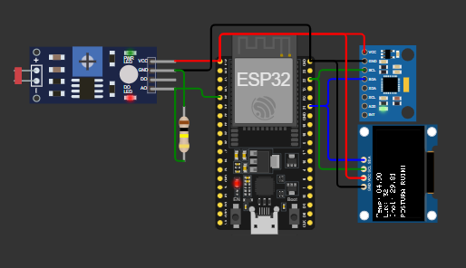
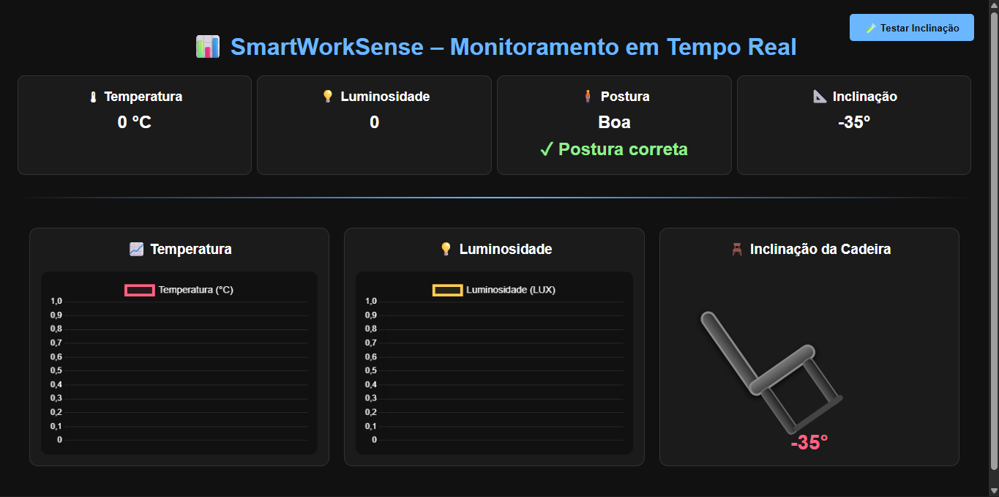

<h1 align="center">📊 SmartWorkSense – Monitoramento Inteligente de Ambiente e Postura</h1>

<p align="center">
  <b>Sistema IoT com ESP32 para monitoramento de postura, luminosidade, temperatura e inclinação da cadeira</b><br>
  <i>Dados enviados em tempo real para dashboard via MQTT + Socket.IO</i>
</p>

---

<h2>🧠 Sobre o Projeto</h2>

O **SmartWorkSense** é um sistema IoT desenvolvido para promover ergonomia e saúde no ambiente de trabalho.  
Ele monitora em tempo real:

- 🌡️ Temperatura  
- 💡 Luminosidade  
- 🪑 Inclinação da cadeira  
- 🧍 Postura do usuário  

Os dados são enviados via **MQTT** para um servidor que distribui os valores para um **dashboard ao vivo** utilizando **Socket.IO** e gráficos dinâmicos.

---

<h2>🔌 Arquitetura Geral</h2>

<p align="center">
  
</p>


**Componentes principais:**

| Componente | Função |
|-----------|--------|
| **ESP32** | Microcontrolador principal |
| **MPU6050** | Detecta inclinação da cadeira e postura |
| **LDR** | Mede luminosidade |
| **OLED 128x64** | Exibe valores localmente |
| **MQTT Broker** | Recebe os dados do ESP32 |
| **Servidor Socket.IO** | Repassa dados para o dashboard |
| **Dashboard Web** | Exibe tudo em tempo real |

---

<h2>📡 Fluxo de Funcionamento</h2>

1️⃣ **ESP32 lê sensores** (MPU6050, LDR, temperatura interna do MPU).  
2️⃣ Dados são empacotados em JSON e enviados via **MQTT** para o broker.  
3️⃣ O servidor Python/Flask consome o MQTT e retransmite usando **Socket.IO**.  
4️⃣ O Dashboard Web atualiza automaticamente sem recarregar a página.  

---

<h2>📷 Dashboard</h2>

<p align="center">
  
</p>

O painel mostra:

- Temperatura (gráfico + valor atual)  
- Luminosidade (gráfico)  
- Inclinação da cadeira com animação  
- Postura do usuário (boa / ruim)  
- Alertas instantâneos  

O design é totalmente responsivo e funciona em notebooks, tablets e celulares.

---

<h2>🧩 Tecnologias Utilizadas</h2>

### 🟦 **Hardware**
- ESP32 (DevKit V1)
- MPU6050
- Sensor LDR + resistor
- Display OLED SSD1306 (I2C)

### 🟨 **Software**
- C++ (Arduino / ESP-IDF)
- Python + Flask
- Socket.IO
- MQTT (Mosquitto)
- Chart.js
- HTML + CSS + JavaScript

---

<h2>🛠️ Configuração do Circuito</h2>

**MPU6050 → ESP32**
| MPU6050 | ESP32 |
|---------|-------|
| VCC | 3.3V |
| GND | GND |
| SCL | 22 |
| SDA | 21 |

**OLED 128x64 → ESP32**
| OLED | ESP32 |
|------|-------|
| VCC | 3.3V |
| GND | GND |
| SCL | 22 |
| SDA | 21 |

**LDR → ESP32**
- LDR + resistor de 10k (divisor de tensão)  
- Saída analógica → GPIO **34**

---

<h2>📦 Exemplo de Payload MQTT</h2>

```json
{
  "temp": 27.5,
  "lux": 320,
  "inclinacao": 12.4,
  "postura": false
}
```

---

<h2>❤️ Agradecimentos</h2>

<p align="center">
  Projeto desenvolvido por <b>Bruno Gama e Kauai Rosa</b><br>
  <i>Projeto acadêmico de IoT e Automação Esportiva</i><br><br>
  Agradecemos seu interesse em recriar e aprimorar este sistema! 👋<br>
  <i>Sinta-se à vontade para expandir o projeto com novos sensores e recursos.</i>
</p>
